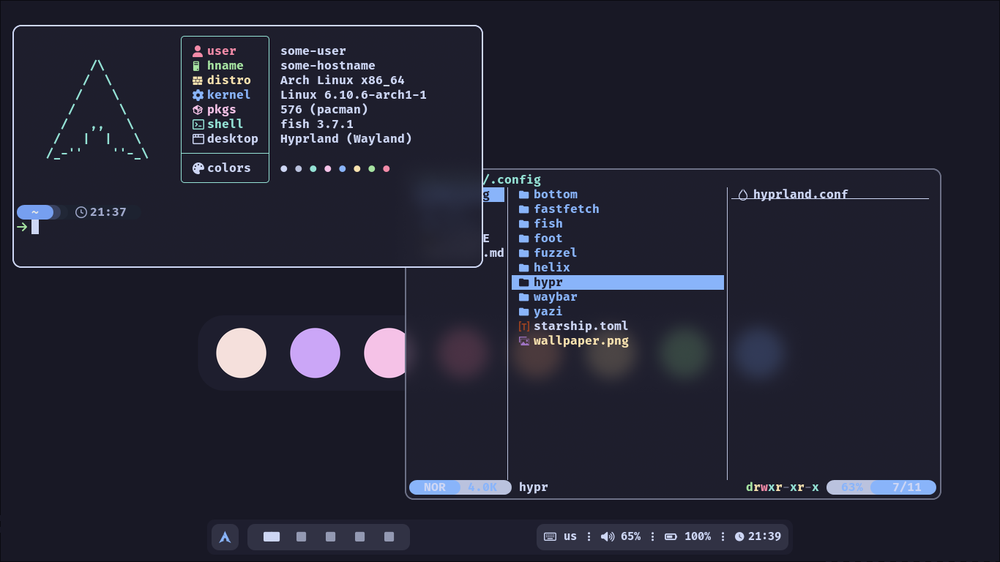
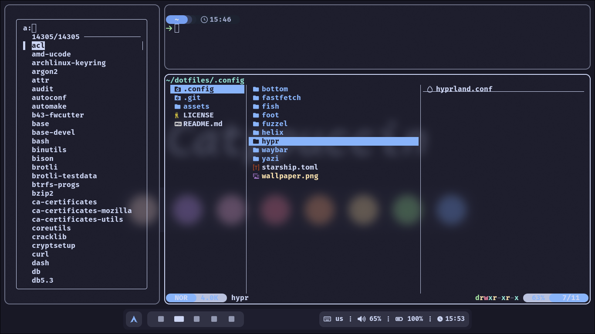

<h1 align="center">catppuccin hyprland dotfiles</h1>

<p align="center">
  <a href="https://github.com/floaaat/dotfiles.git"></a>
  <a href="https://github.com/floaaat/dotfiles.git"></a>
  <a href="https://github.com/floaaat/dotfiles.git"></a>
  <a href="https://github.com/floaaat/dotfiles.git"></a>
  <a href="https://github.com/floaaat/dotfiles.git"></a>
</p>

<p align="middle">
  
  
</p>

<h4 align="center">

  **wm:** `hyprland`
  **bar:** `waybar`
  **launcher:** `fuzzel`
  **term:** `foot`
  **shell:** `fish`

</h4>

<h2 align="center"><b>Installation</b></h2>

```sh
sudo pacman -Sy --needed hyprland waybar fuzzel swww cliphist grim slurp ly \
foot fish yazi helix bottom fastfetch less eza fzf ttf-firacode-nerd
sudo yay -Sy --needed catppuccin-gtk-theme-mocha bibata-cursor-theme

git clone https://github.com/floaaat/dotfiles.git ~/floaaat-dotfiles/
mkdir -p ~/.config/
cp -r ~/floaaat-dotfiles/.config/* ~/.config/

sudo chsh -s /usr/bin/fish

sudo systemctl enable ly.service
```
