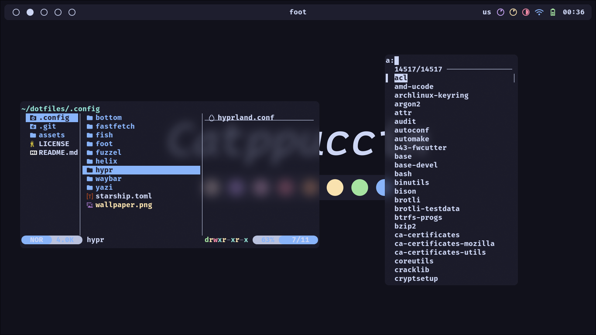

<h1 align="center">Dotfiles</h1>

<p align="middle">
  
  
  
</p>

<details>
  <summary><b>Reqs & Software</b></summary>
  <br>

  **hyprland ( *wm* )**\
  **waybar ( *bar* )**\
  **fuzzel ( *app.menu* )**\
  **clipman ( *clipb.* )**\
  **grimblast ( *screensh.* )**\
  **swww ( *wallp.daemon* )**\
  **ly ( *displ.m* )**

  **foot ( *term* )**\
  **fish ( *shell* )**\
  **yazi ( *file.m* )**\
  **helix ( *editor* )**\
  **bottom ( *sys.mon* )**\
  **fastfetch ( *fetch* )**\
  **eza ( *cd* )**\
  **fzf ( *findin'* )**\
  **less ( *pager* )**

  **firefox ( *browser* )**

  **catppuccin-gtk-theme-mocha**\
  **bibata-cursor-theme**\
  **ttf-firacode-nerd**\
  **archlinux-wallpaper**
</details>

<details>
  <summary><b>Installation</b></summary>
  <br>

  Installing software
  ```sh
  sudo pacman -Suy
  
  sudo pacman -S hyprland waybar fuzzel clipman swww ly \
  foot fish yazi helix fastfetch eza fzf less \
  firefox ttf-firacode-nerd archlinux-wallpaper
  
  yay -S grimblast-git bottom-git \
  catppuccin-gtk-theme-mocha bibata-cursor-theme
  ```
  Copying config files
  ```sh
  git clone https://github.com/floaaat/dotfiles.git ~/floaaat-dotfiles/
  cp ~/floaaat-dotfiles/.config/* ~/.config/
  ```
  Setting up themes
  ```sh
  gsettings set org.gnome.desktop.interface gtk-theme catppuccin-macchiato-blue-standard+default
  gsettings set org.gnome.desktop.interface icon-theme Bibata-Modern-Ice
  ```
  Setting up wallpapers
  ```sh
  swww img /usr/share/backgrounds/archlinux/mountain.jpg
  ```
  Changing shell to fish
  ```sh
  sudo chsh -s /usr/bin/fish
  ```
  Enabling ly.service
  ```sh
  sudo systemctl enable ly.service
  ```
</details>
