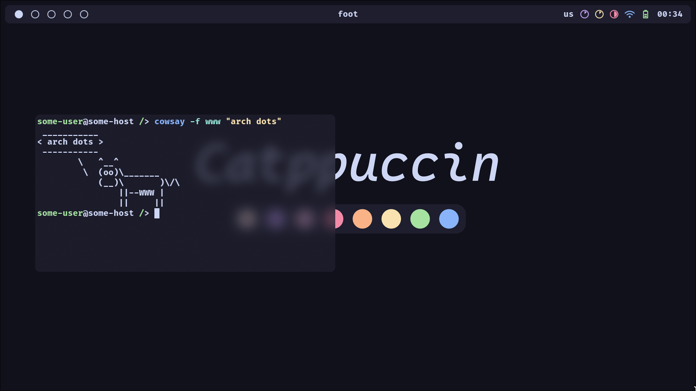

<h1 align="center">Dotfiles</h1>

<p align="middle">
  
  
</p>

<details>
  <summary><b>Reqs & Software</b></summary>
  <br>
  <b>

  |            |           |    |    |           |                |    |    |                      |
  | ---------- | --------- | -- | -- | --------- | -------------- | -- | -- | -------------------- |
  | Distro     | Arch      |    |    | Term      | Foot           |    |    | Catppuccin GTK Theme |
  | WM         | Hyprland  |    |    | Shell     | Fish           |    |    | Bibata Cursor Theme  |
  | Bar        | Waybar    |    |    | Prompt    | Starship       |    |    | Firacode Nerd Font   |
  | Launcher   | Fuzzel    |    |    | File M.   | Yazi           |    |    | Archlinux wallpapers |
  | Wallp. D.  | Sww       |    |    | Editor    | Helix          |    |    |                      |
  | Clipb. M.  | Cliphist  |    |    | Sys. Mon. | Bottom         |    |    |                      |
  | Sceenshots | Grimblast |    |    | Fetch     | Fastfetch      |    |    |                      |
  | DM         | Ly        |    |    | Other     | Less, Eza, Fzf |    |    |                      |

  </b>
</details>

<details>
  <summary><b>Keybindings</b></summary>
  <br>
  <b>

  | Keybinding            | Action                    |
  | --------------------- | ------------------------- |
  | SUPER + CTRL + E      | Exit                      |
  | SUPER + SPACE         | App Menu                  |
  | SUPER + ENTER         | Terminal                  |
  | SUPER + BACKSPACE     | Close Window              |
  | SUPER + E             | File Manager              |
  | SUPER + B             | Browser                   |
  | SUPER + V             | Clipboard                 |
  | PrintScreen           | Screenshot                |
  | SUPER + T             | Toggle Split              |
  | SUPER + F             | Float Mode                |
  | SUPER + P             | Pseudo Mode               |
  | SUPER + arrow         | Move Focus                |
  | SUPER + LMB           | Move Window               |
  | SUPER + RMB           | Resize Window             |
  | SUPER + (1-5)         | Workspace (1-5)           |
  | SUPER + S             | Special Workspace         |
  | SUPER + SHIFT + (1-5) | Move To Workspace (1-5)   |
  | SUPER + SHIFT + S     | Move To Special Workspace |
    
  </b>
</details>

<details>
  <summary><b>Installation</b></summary>
  <br>

  Installing software
  ```sh
  sudo pacman -Suy
  
  sudo pacman -S hyprland waybar fuzzel swww cliphist ly \
  foot fish starship yazi helix fastfetch less eza fzf \
  ttf-firacode-nerd archlinux-wallpaper
  
  yay -S grimblast-git bottom-git \
  catppuccin-gtk-theme-mocha bibata-cursor-theme
  ```
  Copying config files
  ```sh
  git clone https://github.com/floaaat/dotfiles.git ~/floaaat-dotfiles/
  cp ~/floaaat-dotfiles/.config/* ~/.config/
  ```
  Changing shell to fish
  ```sh
  sudo chsh -s /usr/bin/fish
  ```
  Enabling ly.service
  ```sh
  sudo systemctl enable ly.service
  ```
</details>
